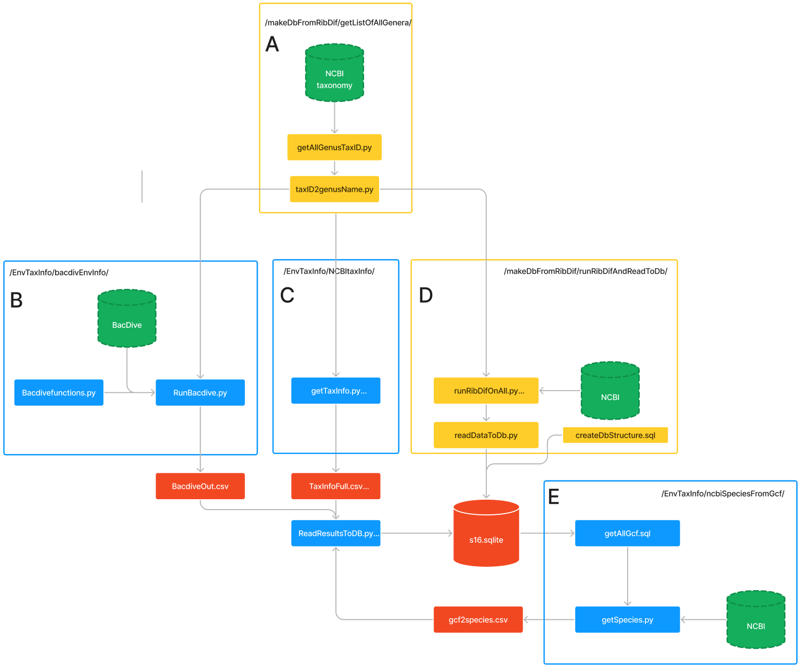

## Purpose
These are the files for gathering the data used for the project. An overview can be seen in the figure below:

## Folders
The datapreparation part of the project contains two main subfolders. The first is "makeDbFromRibDif". This folder contains the files for running ribdif on all genera from NCBI taxonomy. Thereby gathering 16S gene information, which is then read into a sqlite database. In the figure above, the files from this folder are marked with a yellow color (marked by A and D).
The second folder is "EnvTaxInfo". This folder contains the files for gathering taxonomy data from NCBI, and trait and environment information from Bacdive. Which is all read to the main database. In the figure these files are colored blue (marked by B, C and E in the figure).
The specific dataflow is described below. Here the headers are the folder from were the files can be found. The subheaders are the letter which the mark the box with the file in in the figure above.

### makeDbFromRibDif
#### A
Using "getAllGenusTaxID.py", all TAXID's corresponding to all unique genera from "NCBI taxonomy" were downloaded using their API. As the output was JSON and contained additional information, it was parsed and written to a file.   
Using "taxID2genusName.py" the TAXID's corresponding to the unique genera, were then "translated" to their names. This was again done using NCBI'S API.
This output, which was a list of all unique genera, were used in steps marked by B, C and D in the figure:  

#### D
Using "runRIbDifOnAll.py" the tool ribdif were run on all of unique genera found in "A". A database with the corret tables were the created using "createDbStructure.sql". Lastly, the information gathered from Ribdif were read into to database using "readDataToDb.py". The relationships between the 16S gene copies and the bacterial strains were made using many to many relationships in the database. 

### EnvTaxInfo
#### B
Using "RunBacdive.py" with many of it's functions defined in "Bacdivefunctions.py" we requested and parsed trait and environment information from the BacDive database.

#### C
Using "getTaxinfo.py" we extracted taxonomy information for the genera found earlier.

#### E
Using "getAllGcf.sql" all of the "GCF" numbers from our database were extracted. These GCF were then used by "getSpecies.py". This script used NCBI's wrapper for their API called "Datasets" to get genome information in addition to species information.
Lastly the results from the "EnvTaxInfo" (B,C,E) were read into the database using ReadResultsToDB.py.
